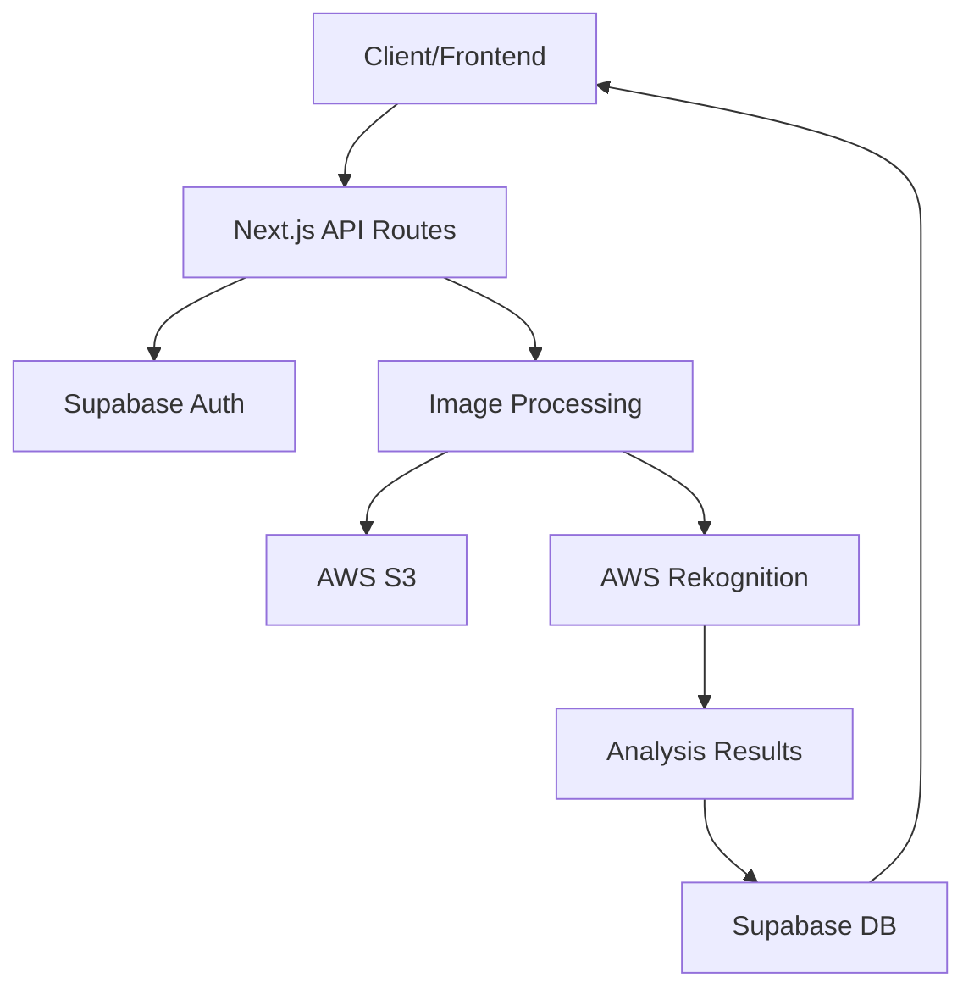
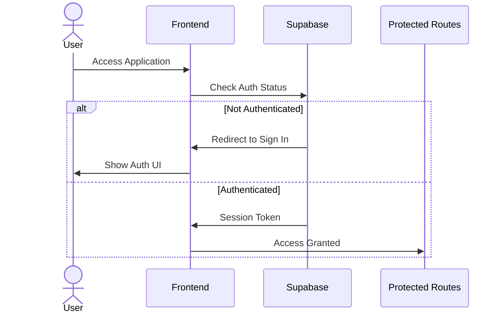
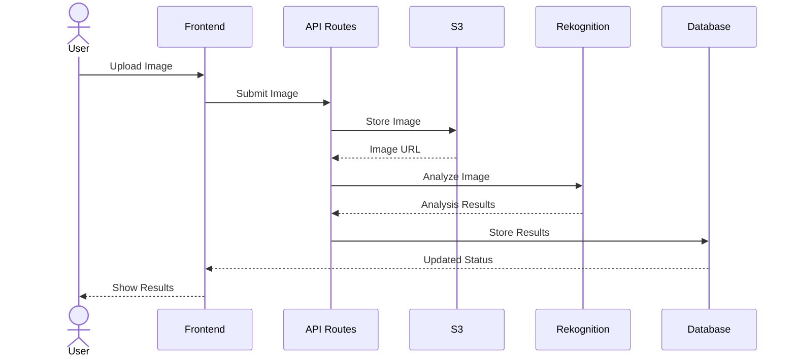
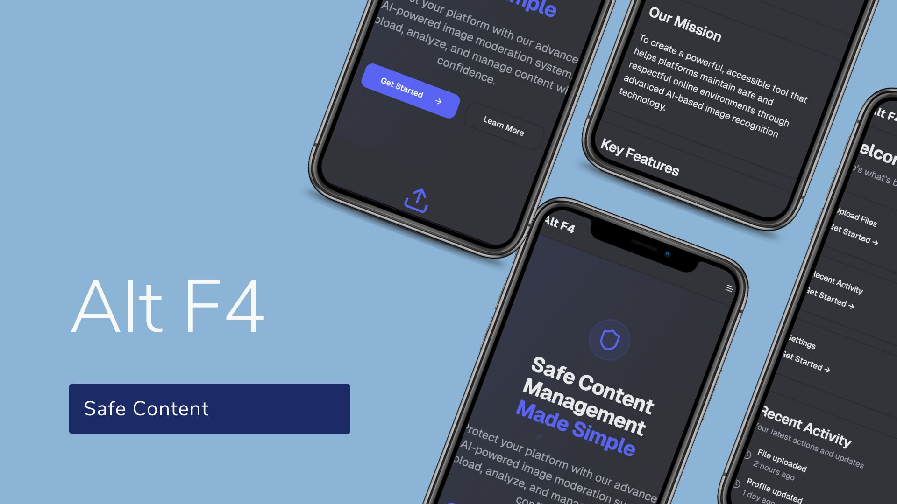
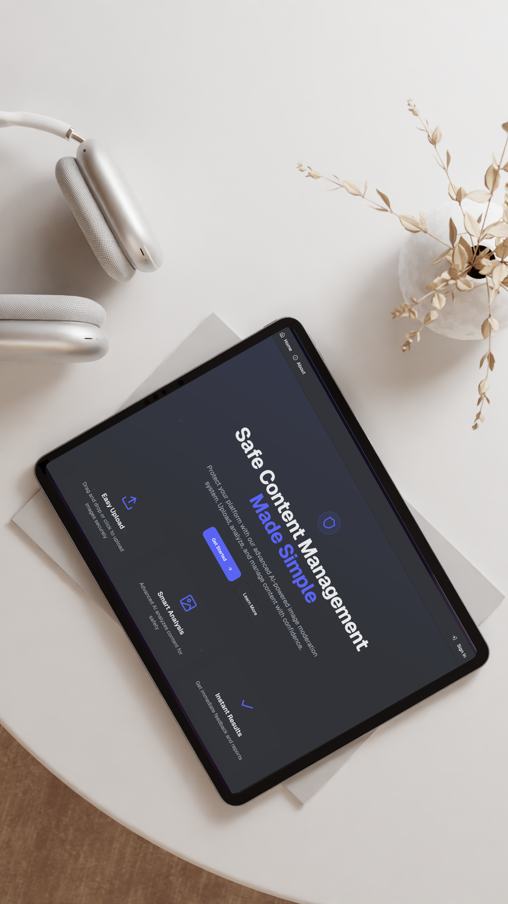
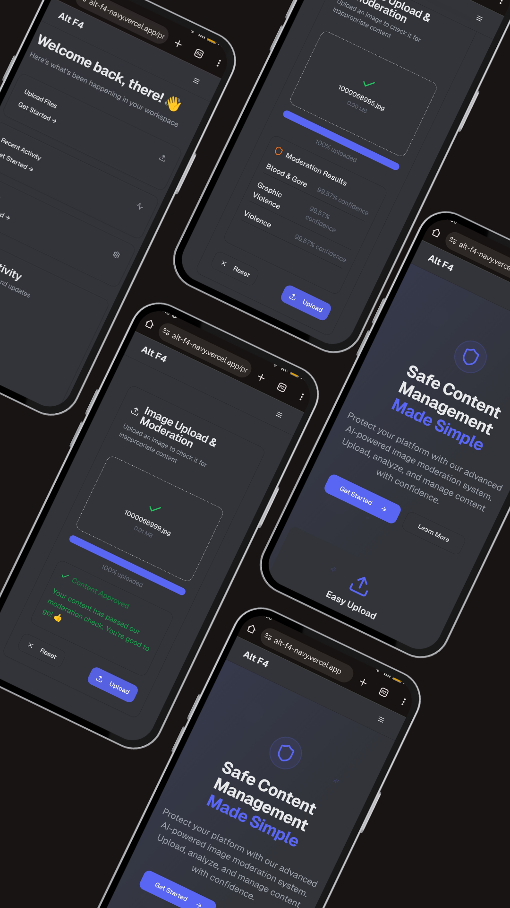

# Alt F4
**Safe Content Management Made Simple.**


## Overview

Protect your platform with our advanced AI-powered image moderation system. Upload, analyze, and manage content with confidence.

## System Architecture

### Core Components


### Authentication Flow


### Image Moderation Flow



## Overview
<div style="display: flex; justify-content: center; flex-wrap: wrap; gap: 20px; margin: 20px 0;">
  
  
  
</div>

Protect your platform with our advanced AI-powered image moderation system. Upload, analyze, and manage content with confidence.


## Directory Structure
```
alt-f4/
├── app/
│   ├── auth-pages/           # Authentication related pages
│   │   ├── sign-in/
│   │   ├── sign-up/
│   │   └── forgot-password/
│   ├── about/               # About page
│   └── protected/           # Protected routes
├── components/
│   ├── ui/                 # UI components
│   ├── typography/         # Typography components
│   └── tutorial/           # Tutorial components
├── lib/
│   └── utils/             # Utility functions
├── utils/
│   └── supabase/          # Supabase client config
```

## Tech Stack
- [Next.js](https://nextjs.org/) - React Framework
- [Bun](https://bun.sh/) - JavaScript Runtime
- [Supabase](https://supabase.com/) - Backend as a Service
- AWS Services:
  - Amazon Rekognition - Image Analysis
  - Amazon S3 - Image Storage

## Key Features
1. **Authentication**
   - Secure user authentication via Supabase
   - Protected routes and content
   - Password recovery system

2. **Image Processing**
   - Direct upload to AWS S3
   - Real-time moderation via AWS Rekognition
   - Result storage in Supabase

3. **User Interface**
   - Responsive design
   - Dark/Light mode support
   - Real-time feedback
   - Tutorial system

## Prerequisites
- Bun (Latest Version)
- AWS Account with access to Rekognition and S3
- Supabase Account

## Setup

1. Clone the repository:
```bash
git clone [your-repository-url]
cd alt-f4
```

2. Install dependencies:
```bash
bun install
```

3. Configure environment variables:
Create a `.env` file in the root directory with the following:
```env
NEXT_PUBLIC_SUPABASE_URL=your_supabase_url
NEXT_PUBLIC_SUPABASE_ANON_KEY=your_supabase_anon_key
AWS_ACCESS_KEY1=your_aws_access_key
AWS_SECRET_KEY1=your_aws_secret_key
AWS_REGION1=your_aws_region
S3_BUCKET_NAME1=your_s3_bucket_name
```

## Development

Start the development server:
```bash
bun run dev
```

## Build

Create a production build:
```bash
bun run build
```

## AWS Services Setup

1. Create an AWS account if you haven't already
2. Enable Amazon Rekognition in your AWS Console
3. Create an S3 bucket for image storage
4. Create an IAM user with appropriate permissions for Rekognition and S3
5. Generate access keys and add them to your environment variables

## Supabase Setup

1. Create a new Supabase project
2. Get your project URL and anon key from the project settings
3. Add them to your environment variables

## Team

- Ashwin - Full Stack Developer
- Yugha - Frontend Developer
- Udit - UI/UX Developer
- Arshia - System Design

## License

[Your chosen license]
